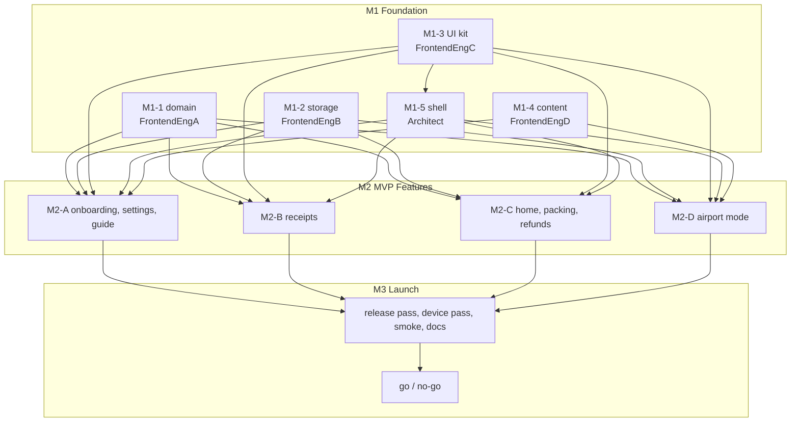

# Implementation Plan — M1, M2, M3

| | |
|---|---|
| Status | v1.0 |
| Date | 2026-10-06 |
| Owner | Senior architect (tech lead) |
| Tracking | Epic #1 |
| Inputs | [brief](../product/brief.md) · [domain rules](../product/domain-rules.md) · [user journey](../product/user-journey.md) · [IA](../design/information-architecture.md) · [wireframes](../design/wireframes.md) · [components](../design/components.md) · [test strategy](../qa/test-strategy.md) · [test cases](../qa/test-cases.md) |

How Kaeru gets from a working shell to a launched product: 45 issues across three
milestones, sized to one pull request each, split so that five people can work at once
without waiting on each other or editing the same files.

---

## 1. How this plan runs

**Ownership is by directory, not by taste.** Each slice owns a path and nobody else
writes there. Two agents editing one file is the failure mode that costs a day, so the
split is drawn along directory lines that the module map already enforces
([overview](overview.md) section 2).

**Contracts land before the work, not during it.** The pull request that introduces this
plan also introduces the TypeScript types every slice codes against (section 2). They are
types only — no runtime value, no behaviour, nothing to disagree about later. A slice that
needs a contract changed opens that change as its own small pull request and the architect
reviews it, so the change is visible rather than discovered at integration.

**One issue is one pull request.** If an issue cannot be reviewed in one sitting it was
sized wrong; say so on the issue and split it rather than opening a 2,000-line pull request.

**Conventional Commits, English, and a cross-role review on every pull request.** The
review pairs are listed per slice. The author answers every point — fixed with a commit, or
answered with reasoning — before merging. CI must be green.

**Validation is per pull request, never mid-flight across slices.** Run `npm run check`
and the tests for your own change. Do not run a project-wide formatter over files you do
not own.

**Blocked is a message, not a wait.** If a slice needs something from another, say so over
hub immediately. Every dependency in the tables below is a real ordering constraint; nothing
else is.

---

## 2. Contracts landed with this plan

Types only. Zero runtime cost: the production bundle is byte-identical with these files
present. Each is implemented by exactly one slice.

| File | What it fixes | Implemented by |
|---|---|---|
| `src/domain/model.ts` | Trip, Traveler, Receipt, ReceiptLine, OperatorRegistration, Operator, and the closed `DR-060` status set. Field names match `domain-rules.md` section 1 exactly | M1-1 |
| `src/domain/rules.ts` | `Dated<T>`, `RulesData`, `ResolvedRules`, and the resolver signatures. The shape that makes a rule change a data change | M1-1 |
| `src/domain/api.ts` | The engine's public surface as function types: money, threshold, deadlines, lifecycle, validation, readiness, totals, action items | M1-1 |
| `src/data/repositories.ts` | Repository interfaces for schema v2, the photo store, quota errors, and the v2 backup envelope | M1-2 |
| `src/ui/contracts.ts` | Prop types for all fifteen components in `components.md` | M1-3 |
| `src/content/schema.ts` | Guide articles, FAQ, source references and the operator directory | M1-4 |
| `src/app/navigation.ts` | Route patterns with parameters, sheet-as-route, chrome kinds, feature registration v2, the shell banner, and `pathTo()` over a screen-id map so a cross-track link is a type error rather than a blank screen | M1-5 |

Two conventions the types enforce deliberately:

- **UI components take translated strings, never message keys.** The kit has no opinion
  about i18n, which keeps it testable and keeps copy with the feature that owns it.
- **Domain functions take an injected `Clock` and an explicit time zone.** There is no
  `new Date()` under `src/domain`, because three of QA's top five risks are date and
  money correctness.

### One deviation from the IA, stated plainly

The IA sketches a sheet route as `/receipts/new#operator`. A hash-routed app cannot carry
a second `#`, so sheets are `?sheet=<id>` on the current route instead. The property the
IA actually asks for is preserved: the sheet is part of the URL, so browser back closes the
sheet rather than leaving the screen.

---

## 3. Where this plan differs from the suggested split, and why

Three changes. Everything else follows the PM's shape.

**1. M1 gains a fifth slice: the app shell and navigation (M1-5), owned by the architect.**
The suggested four M1 slices — domain, data, UI kit, content — produce no router. M2 needs
nested routes with parameters, sheets that live in the URL, chrome that differs per screen
(tabs, full-screen flow, Airport Mode takeover), badge-bearing tabs, and a non-dismissible
shell banner. All four M2 tracks consume it, so it cannot be M2 work: it would become the
thing three tracks wait on. It is the integration boundary, so the person who merges
everything owns it. If the PM would rather spawn a fifth engineer, the slice is
self-contained and hands over cleanly.

**2. The guide moves from the Airport track to the onboarding track in M2.** The suggestion
paired Airport Mode with the Guide (five screens). Airport Mode is the flow where a
mistake costs a traveler real money, it is the one that must work offline in a queue, and
it carries QA risk R05 at the top of the register. It gets a track to itself. The Guide is
five read-mostly screens over bundled content with no domain logic, which sits naturally
beside onboarding and settings — the other calm, form-and-prose track.

**3. Slice sizes are deliberately uneven across milestones, and even in sum.** The domain
engine is six issues in M1 and its owner then takes the lightest M2 track; content is three
issues in M1 and its owner then takes Airport Mode, the heaviest M2 track. That gives the
Airport Mode owner slack during M1 to read the procedure research properly before building
the flow that depends on it.

Screen coverage is complete: all 46 IDs in the IA inventory appear in exactly one M2 issue.

---

## 4. M1 — Foundation

**Goal:** everything M2 needs, and nothing a user sees. Exit when all 22 issues are merged,
`src/domain` coverage is at or above 90%, the i18n parity test covers the content layer,
the guardrail suite is green, and the shell renders a feature registered through the v2
contract.

### M1-1 — Domain rules engine

**Owner: FrontendEngA** · owns `src/domain/**`
**Reviewers:** Architect (code) · JapanExpert (rule correctness) · QALead (tests)

The pure engine behind every money, date and status decision in the app.

| Issue | Key | What | Depends on |
|---|---|---|---|
| [#13](../../issues/13) | `M1-1a` | ship the rules as effective-dated data with a resolver | none |
| [#14](../../issues/14) | `M1-1b` | tax extraction, refund estimate and the fee warning | [#13](../../issues/13) (needs `ResolvedRules`) |
| [#15](../../issues/15) | `M1-1c` | purchase threshold and same-shop same-day grouping | [#13](../../issues/13) |
| [#16](../../issues/16) | `M1-1d` | export deadlines, trip phase and departure time | [#13](../../issues/13) |
| [#17](../../issues/17) | `M1-1e` | status lifecycle transitions and validation findings | [#13](../../issues/13) |
| [#18](../../issues/18) | `M1-1f` | airport readiness, trip totals and action items | [#14](../../issues/14), [#15](../../issues/15), [#16](../../issues/16), [#17](../../issues/17) |

### M1-2 — Storage, photos and backup

**Owner: FrontendEngB** · owns `src/data/**`
**Reviewers:** Architect (code) · QALead (tests, data-loss scenarios)

Durable local storage for the whole model, and the only way data leaves the device.

| Issue | Key | What | Depends on |
|---|---|---|---|
| [#19](../../issues/19) | `M1-2a` | schema v2 migration with trip and traveler repositories | none |
| [#20](../../issues/20) | `M1-2b` | receipt and registration repositories | [#19](../../issues/19) |
| [#21](../../issues/21) | `M1-2c` | photo blob store, quota handling and persistent storage | [#19](../../issues/19) |
| [#22](../../issues/22) | `M1-2d` | backup v2 — export, preview, import, delete all | [#19](../../issues/19), [#20](../../issues/20), [#21](../../issues/21) |

### M1-3 — UI kit

**Owner: FrontendEngC** · owns `src/ui/**, src/features/gallery/**`
**Reviewers:** Architect (code) · UXDesigner (conformance, via the gallery) · QALead (a11y)

Every shared component the 46 screens are assembled from.

| Issue | Key | What | Depends on |
|---|---|---|---|
| [#23](../../issues/23) | `M1-3a` | app bar, button variants, card, list row, status chip, empty state | none |
| [#24](../../issues/24) | `M1-3b` | bottom navigation, progress, banner and toast | [#23](../../issues/23) |
| [#25](../../issues/25) | `M1-3c` | amount display and the form field family | [#23](../../issues/23) |
| [#26](../../issues/26) | `M1-3d` | bottom sheet, select sheet, checklist row and the Airport Mode stepper | [#23](../../issues/23), [#24](../../issues/24), [#25](../../issues/25) |
| [#27](../../issues/27) | `M1-3e` | gallery capture matrix for design and accessibility review | [#23](../../issues/23), [#24](../../issues/24), [#25](../../issues/25), [#26](../../issues/26) |

### M1-4 — Bundled content

**Owner: FrontendEngD** · owns `src/content/**`
**Reviewers:** Architect (code) · JapanExpert (content and sources) · UXDesigner (reading experience)

The guide, the FAQ and the operator directory, bundled so they work offline.

| Issue | Key | What | Depends on |
|---|---|---|---|
| [#28](../../issues/28) | `M1-4a` | content layer — schema implementation, loader and parity test | none |
| [#29](../../issues/29) | `M1-4b` | bilingual guide articles with sources and access dates | [#28](../../issues/28) |
| [#30](../../issues/30) | `M1-4c` | FAQ and the ten-operator directory | [#28](../../issues/28) |

### M1-5 — App shell and navigation v2

**Owner: Architect** · owns `src/app/**`
**Reviewers:** QALead (routing and offline behaviour) · UXDesigner (chrome conformance)

The routing, chrome and registration contract that all four M2 tracks build on. It lands first because everything else in M2 consumes it.

| Issue | Key | What | Depends on |
|---|---|---|---|
| [#31](../../issues/31) | `M1-5a` | router v2 — parameters, sheet routes, chrome and guards | none |
| [#32](../../issues/32) | `M1-5b` | shell chrome — four tabs, app bar host, banner slot, toast host | [#31](../../issues/31), [#23](../../issues/23), [#24](../../issues/24) |
| [#33](../../issues/33) | `M1-5c` | feature registry v2 and migration of the existing screens | [#31](../../issues/31), [#32](../../issues/32) |
| [#59](../../issues/59) | `M1-5d` | guardrails for the rules the app must never break | [#13](../../issues/13), [#29](../../issues/29) |

### M1 order of play

`M1-1a`, `M1-2a`, `M1-3a`, `M1-4a` and `M1-5a` have no dependencies and start together
on day one. After that each slice is internally sequential and externally independent
except for two one-way edges: `M1-5b` needs the first two UI kit issues, and `M1-5d` needs
the rules data and the ported guides it compares.

---

## 5. M2 — MVP Features

**Goal:** all 46 screens, in both languages, with tests. Exit when every MVP journey has an
E2E test in both locales, the offline suite is green, axe reports zero serious or critical
violations on every route, and there are no open S1 or S2 defects.

Every screen ID below comes from `information-architecture.md` section 3 and is drawn in
`wireframes.md`.

### M2-A — Onboarding, settings and guide

**Owner: FrontendEngA** · owns `src/features/onboarding/**, src/features/settings/**, src/features/guide/**`
**Reviewers:** Architect (code) · UXDesigner (screens) · QALead (verification) · JapanExpert (guide content)

First run, the settings surface, and the guide the whole app links into.

| Issue | Key | What | Depends on |
|---|---|---|---|
| [#34](../../issues/34) | `M2-A1` | welcome, explainer, trip setup, travelers, ready — S01 S05 S02 S03 S04 | [#33](../../issues/33), [#25](../../issues/25), [#19](../../issues/19) |
| [#35](../../issues/35) | `M2-A2` | settings index, trip settings and privacy — S60 S61 S63 | [#33](../../issues/33), [#25](../../issues/25), [#19](../../issues/19) |
| [#36](../../issues/36) | `M2-A3` | data screen — export, import with preview, delete all — S62 | [#22](../../issues/22), [#33](../../issues/33) |
| [#37](../../issues/37) | `M2-A4` | guide index, article and FAQ — S50 S51 S54 | [#29](../../issues/29), [#30](../../issues/30), [#33](../../issues/33), [#23](../../issues/23) |
| [#38](../../issues/38) | `M2-A5` | operator directory and operator detail — S52 S53 | [#30](../../issues/30), [#33](../../issues/33), [#23](../../issues/23) |

### M2-B — Receipts

**Owner: FrontendEngB** · owns `src/features/receipts/**`
**Reviewers:** Architect (code) · UXDesigner (screens) · QALead (verification) · JapanExpert (rule rendering)

The thing the traveler does fifteen times a trip, in under twenty seconds each.

| Issue | Key | What | Depends on |
|---|---|---|---|
| [#39](../../issues/39) | `M2-B1` | receipt list with shop-day grouping and empty state — S20 S28 | [#15](../../issues/15), [#20](../../issues/20), [#33](../../issues/33), [#23](../../issues/23), [#25](../../issues/25) (money rendering: `ListRowProps.amount` is `AmountDisplayProps`) |
| [#40](../../issues/40) | `M2-B2` | the twenty-second add screen with its defaults sheets — S21 S24 S26 | [#14](../../issues/14), [#15](../../issues/15), [#17](../../issues/17), [#20](../../issues/20), [#25](../../issues/25), [#33](../../issues/33) |
| [#41](../../issues/41) | `M2-B3` | detail, status timeline, fee warning and old-system receipts — S22 S2B S29 | [#39](../../issues/39), [#14](../../issues/14), [#17](../../issues/17), [#30](../../issues/30) |
| [#42](../../issues/42) | `M2-B4` | edit, traveler chooser, not-claiming and photo view — S23 S25 S2A S27 | [#40](../../issues/40), [#41](../../issues/41), [#21](../../issues/21), [#26](../../issues/26) |

### M2-C — Home, packing plan and refunds

**Owner: FrontendEngC** · owns `src/features/home/**, src/features/refunds/**`
**Reviewers:** Architect (code) · UXDesigner (screens) · QALead (verification)

The screen the user opens by reflex, and the one that tells them whether the money arrived.

| Issue | Key | What | Depends on |
|---|---|---|---|
| [#43](../../issues/43) | `M2-C1` | phase-aware home with hero, trip strip and summary — S10 S11 S12 | [#16](../../issues/16), [#18](../../issues/18), [#33](../../issues/33), [#23](../../issues/23), [#25](../../issues/25) (money rendering) |
| [#44](../../issues/44) | `M2-C2` | tonight's list — S15 | [#43](../../issues/43) |
| [#45](../../issues/45) | `M2-C3` | packing plan and departure day — S17 S13 | [#43](../../issues/43), [#18](../../issues/18), [#42](../../issues/42) (the integrity check routes into the S2A not-claiming sheet) |
| [#46](../../issues/46) | `M2-C4` | after-trip home, refund tracker and operator detail — S14 S40 S41 | [#43](../../issues/43), [#14](../../issues/14), [#18](../../issues/18), [#25](../../issues/25), [#30](../../issues/30) |
| [#47](../../issues/47) | `M2-C5` | trip summary — S16 | [#46](../../issues/46) |

### M2-D — Airport Mode

**Owner: FrontendEngD** · owns `src/features/airport/**`
**Reviewers:** Architect (code) · UXDesigner (screens) · QALead (offline and verification) · JapanExpert (procedure correctness)

The ten-screen sequence that has to work in a queue, offline, under time pressure. The highest-stakes flow in the product.

| Issue | Key | What | Depends on |
|---|---|---|---|
| [#48](../../issues/48) | `M2-D1` | mode entry, readiness and the something's-wrong hatch — S30 S39 | [#18](../../issues/18), [#26](../../issues/26), [#32](../../issues/32), [#33](../../issues/33) |
| [#49](../../issues/49) | `M2-D2` | step 1 gather goods, the advance gate and the bag-drop banner — S31 | [#48](../../issues/48) |
| [#50](../../issues/50) | `M2-D3` | landside, the terminal, green, red and used goods — S32 S33 S34 S35 S36 | [#49](../../issues/49), [#20](../../issues/20), [#29](../../issues/29) |
| [#51](../../issues/51) | `M2-D4` | customs done and what happens next — S37 S38 | [#50](../../issues/50) |

### M2 cross-track rules

- Tracks own disjoint feature folders and never import each other. Anything two tracks need
  belongs in `src/domain`, `src/data`, `src/ui` or `src/content`.
- A track that wants a change to a shared contract opens a separate small pull request
  against the owning slice's path and the architect reviews it. Do not fork a type.
- Every UI pull request attaches screenshots in both languages at a 390 px viewport.
- Every screen renders `data-screen="S.."` so QA can assert which screen is on the page.

---

## 6. M3 — Launch

**Goal:** proof that what is on the live site is what we think it is, before the new system
starts on 2026-11-01.

| Issue | Key | What | Owner | Reviewers | Depends on |
|---|---|---|---|---|---|
| [#52](../../issues/52) | `M3-1` | production smoke spec and post-deploy alerting | Architect | QALead | none |
| [#53](../../issues/53) | `M3-2` | M3 release pass — full matrix, coverage gates, release checklist | QALead | Architect | All M2 issues merged. |
| [#54](../../issues/54) | `M3-3` | manual device and screen-reader pass on iOS and Android | QALead | UXDesigner | All M2 issues merged. |
| [#55](../../issues/55) | `M3-4` | launch documentation refresh | Architect | QALead | All M2 issues merged. |
| [#56](../../issues/56) | `M3-5` | launch checklist and go / no-go | Main | Architect, QALead | [#52](../../issues/52), [#53](../../issues/53), [#54](../../issues/54), [#55](../../issues/55) |

The production smoke observes and files; it never reverts, never redeploys and never mutates
anything. An automated revert turns every false positive into a real outage, and the smoke
runs against a CDN we do not control, so its failure modes include propagation lag and
upstream incidents that a revert would make worse.

---

## 7. Dependency graph

The only cross-slice edge inside M1 is UI kit to shell. Everything else in M1 is parallel,
and every M2 track depends on all of M1 rather than on another track.

---

## 8. Decisions carried into this plan

| # | Decision | Where it lands |
|---|---|---|
| 1 | Receipt photos in an export are **opt-in**, behind an unchecked box with a size estimate (`DR-042`) | `BackupOptions.includePhotos` defaults false — `M1-2d`, surfaced in `M2-A3` |
| 2 | Archived trips **are** included in an export by default — a backup that is not complete is not a backup | `BackupOptions.includeArchived` defaults true — `M1-2d` |
| 3 | `fee.warnBelowJpy = 2000`, held as rules data rather than code (`DR-027`) | `RulesData.fee` — `M1-1a`, rendered by `M2-B3` |
| 4 | Contrast ratios are asserted by an automated test over the token file, not trusted from the doc | QA owns the test; `M1-3a` asserts no raw hex, px or duration exists in `src/ui` |
| 5 | `--color-text-on-primary` was renamed `--color-on-primary` | Already applied in M0 |
| 6 | Sheets are `?sheet=<id>`, not a nested `#`; a deep link **into** a screen is a path segment, so the FAQ route is `/guide/faq/:entryId` | `src/app/navigation.ts` — `M1-5a` |

### Decisions taken in review of this plan

| # | Decision | Where it lands |
|---|---|---|
| 7 | `RefundEstimate` models **both** deductions in `DR-025`, not just the operator fee. `Trip.receivingChargeJpy` is the traveler's own bank charge, applied only to a bank-transfer payout and **once per transfer** — so `EstimateRefund` assumes a solo payout (the safe direction) and `EstimateOperatorPayout` is the honest figure for a group. Evidence: PP-03, a ¥19,805 purchase that arrived as NT$77, where the operator's 2.2% was the smaller bite | `src/domain/api.ts` — `M1-1b`, rendered by `M2-C4` |
| 8 | `Receipt.hasHighValueItem` is `boolean \| null`: null derives, non-null is the user's answer and always wins. A plain boolean could not survive a recompute after a line edit, and the override is the whole point (`DR-016`) | `src/domain/model.ts` — `M1-1b` |
| 9 | `UR-07` gets acceptance criteria rather than two doc comments. A device on US Pacific reads a 23:30 JST purchase on 31 October as 30 October, which would silently route a refund-method receipt into the old system | `M1-1a`, `M1-1d`, `M2-B2` |
| 10 | Guide prose keeps its literal numbers; the three that must not drift from the rules data are **asserted**, not interpolated. Templating a threshold through two grammars buys a brittle string for a number that has not moved since 2018 | `M1-5d` |
| 11 | The gallery is built incrementally across `M1-3a`..`M1-3d`, so design review happens while a slice is open rather than after it merges. `M1-3e` is the capture matrix, and it adds 200% text, forced `:focus-visible` and `prefers-reduced-motion` — where components actually break | `M1-3a`..`M1-3e` |
| 12 | S24 and S26 ship with S21, because the defaults row is their trigger and the twenty-second budget cannot be measured against an inert row. S39 ships first in the Airport track, because every later step links to it and a hash route that matches nothing renders a blank screen | `M2-B2`, `M2-D1` |

---

## 9. What would make me re-plan

- **A rule changes before M2 ends.** The dated-data design absorbs a value change without a
  code change. A change to the *shape* of a rule — for example, a threshold that depends on
  something other than shop, day and traveler — invalidates `M1-1c` and the receipt list,
  and would need a new ADR.
- **Photo storage turns out to be unusable on iOS.** `M1-2c` is the canary. If quota or
  eviction makes photos unreliable, the photo becomes genuinely optional everywhere and
  `M2-B4` shrinks; nothing else moves.
- **The twenty-second budget is not met on a real device.** `M2-B2` is the screen the
  product lives or dies by. If it misses, that is a product conversation with the PM and the
  UX designer, not a quiet compromise in a pull request.
- **A track falls more than two issues behind.** Tracks are independent by construction, so
  the recovery is to move an issue, not to serialise. Say so early.
