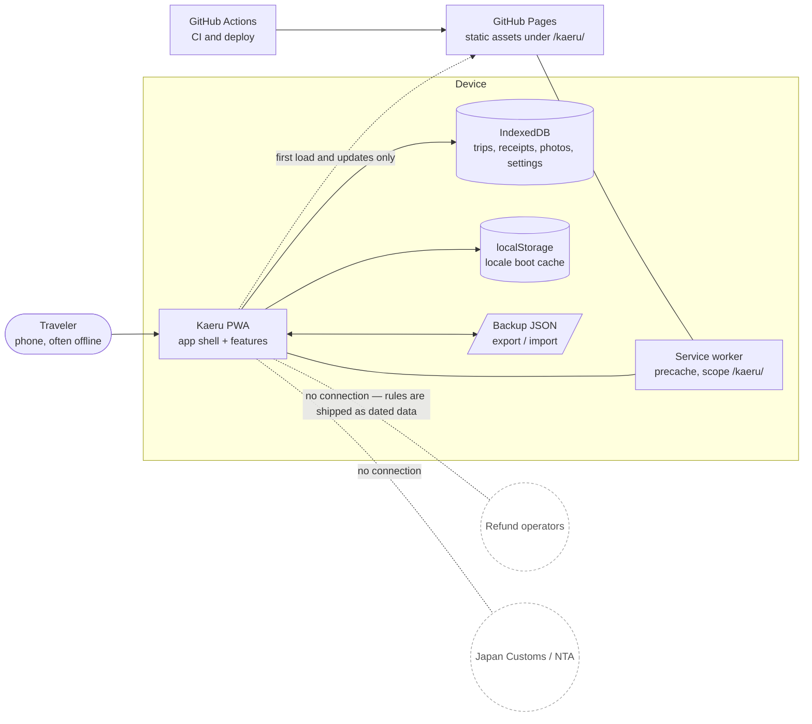
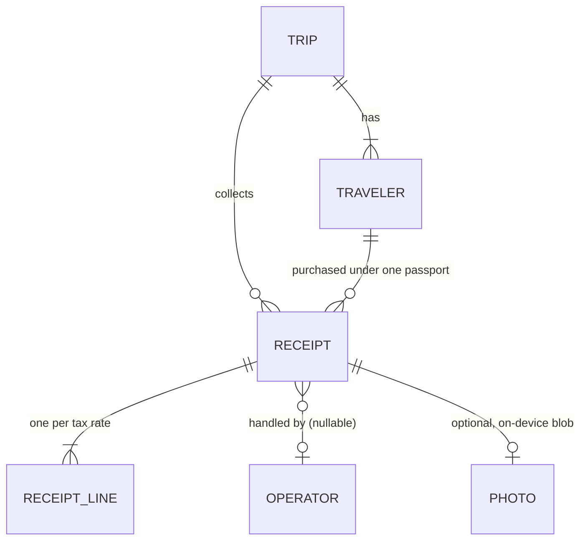

# Architecture Overview

| | |
|---|---|
| Status | v1.0 (M0) |
| Date | 2026-10-05 |
| Owner | Senior architect |
| Tracking | Issue #4 |

How Kaeru is put together and why. Decisions and their trade-offs live in
[`docs/adr/`](../adr/); this document describes the system as it exists and the rules a
contributor has to follow. It is updated whenever the structure changes.

Related: [Product brief](../product/brief.md) · [Domain rules](../product/domain-rules.md) ·
[Visual language](../design/visual-language.md) · [Test strategy](../qa/test-strategy.md) ·
[Implementation plan](implementation-plan.md)

---

## 1. Context

Kaeru is a static, local-first PWA. There is no backend, no account and no third party at
runtime. Everything the app knows ships with the build; everything the user enters stays on
the device.



The dashed links to operators and customs are the important part of this diagram: Kaeru
never talks to them. Every status in the app is **user-asserted** (`DR-062`), and every rule
is data we shipped, with an effective date and a source.

---

## 2. Module map

```
src/
  domain/        pure TypeScript: types, rules, calculations. No DOM, no storage, no I/O
  i18n/          locales, typed message bundles, Intl formatting
  data/          IndexedDB repositories, migrations, backup
  content/       bundled guide, FAQ and operator catalogue — build-time data, not user data
  ui/            shared presentational components over the design tokens
  features/      one folder per feature: screen, feature state, messages, registration
  app/           shell, router, feature registry, app-level state, service-worker state
  styles/        tokens.css (owned by UX) and base.css
  test-support/  builders and fixtures for tests (M1; nothing in the app imports it)
```

| Module | Responsibility | May import |
|---|---|---|
| `domain` | Money, dates, eligibility, deadlines, status transitions. Deterministic, injectable clock, no globals | nothing |
| `i18n` | `Locale`, typed bundles, parity, `Intl` wrappers | `domain` |
| `data` | Opening and migrating the database, repositories, export/import | `domain`, `i18n` |
| `content` | Guide articles, FAQ, source citations, the operator catalogue. Ships with the build so it works offline, and is the only place rule prose lives | `domain`, `i18n` |
| `ui` | Shared presentational components. No product knowledge, no message keys — it takes translated strings | `i18n` |
| `features/*` | One user-facing area: screen, its state, its messages, its routes | `domain`, `data`, `content`, `ui`, `i18n`, and `app/navigation.ts`, `app/router.ts`, `app/settings-store.ts` |
| `app` | Shell, header, bottom navigation, routing, registry, settings and update state | everything except a feature's internals |

### Dependency rules

1. **`domain` depends on nothing.** Not on `data`, not on the DOM, not on `Intl` defaults,
   not on the wall clock. If a rule needs "now", it takes a `Clock`.
2. Dependencies point **one way**: `domain → i18n → data → content → ui → features → app`.
   A module never imports from a later column.
3. **Features never import each other.** Anything two features need belongs in `domain`,
   `data`, `content`, `ui` or `i18n`.
4. `app/registry.ts` is the only module that imports features (through a glob). Features may
   import app-level *state* modules (`router.ts`, `settings-store.ts`, `feature.ts`) but
   never the registry or the shell — that would be a cycle.
5. Product copy lives in `messages.ts` files only. A string literal rendered to the user
   anywhere else is a bug.

---

## 3. Feature auto-registration

A feature is a folder with an `index.ts` that exports a `feature` descriptor:

```ts
export const feature = defineFeature({
  id: 'settings',
  path: '/settings',
  messages,
  screen: SettingsScreen,
  nav: { order: 90, labelKey: 'settings.nav', icon: SettingsIcon },
});
```

`src/app/registry.ts` collects them with
`import.meta.glob('/src/features/*/index.ts', { eager: true })`, and `src/i18n/catalogs.ts`
collects message bundles the same way.

The point is parallel work: **adding a feature touches no shared file.** No route table, no
navigation array, no translation index, so two feature branches cannot conflict over
registration. `collectFeatures` throws at startup if two features claim the same route, and
`defineFeature` is generic over the feature's message keys so `nav.labelKey` is type-checked
against its own bundle.

Bottom-navigation entries are whatever features declare `nav`, sorted by `order` (sparse
numbering — 10, 90 — so a feature can be inserted without renumbering).

---

## 4. Data flow

**Reading.** `main.tsx` starts the router and renders the shell. The shell resolves the
route to a feature and renders its screen. The screen reads from repositories in `data`,
passes the result through `domain` functions, and renders with `useMessages`.

**Writing.** A screen calls a repository, which writes inside one IndexedDB transaction and
returns the stored value. Reactive state (`activeLocale`, `settings`, `currentPath`,
`needRefresh`) lives in signals; reading `.value` during render subscribes that component,
so a language switch re-renders the whole UI with no provider tree.

**Boot order.** Render first in the detected language (synchronous `localStorage` boot
cache), then reconcile with the stored settings when IndexedDB answers. The user never sees
a flash of the wrong language, and the database is never on the critical path to first paint.

---

## 5. Conventions

| Area | Convention |
|---|---|
| Files | Components `PascalCase.tsx` with a sibling `PascalCase.module.css`; everything else `kebab-case.ts`; tests `*.test.ts(x)` next to the source; E2E `e2e/*.spec.ts` |
| Imports | Explicit `.ts` / `.tsx` extensions; a module's public surface is its `index.ts`; `@/` alias available for deep paths |
| Types | `strict` plus `noUncheckedIndexedAccess` and `exactOptionalPropertyTypes`. No `any`, no non-null `!`. Union types, not enums |
| Money | Integer JPY only (`DR-071`). No floats, ever. A `toBeCloseTo` on money is a bug report |
| Dates | `YYYY-MM-DD` calendar strings with an explicit time zone, never UTC instants (`DR-002`) |
| State | Local `useState` by default; a signal only when more than one screen needs it |
| Stored strings | Translate at the boundary, **store the key**. Any user-facing string that outlives the render that produced it — an error, a toast, a pending confirmation, anything held in state or a signal — is held as a message key and translated where it is rendered. A sentence translated when it is produced stops being in the user's language the moment they switch, and the error line is the worst place for that: it is the one sentence they are reading carefully. The companion rule is that `ui/contracts.ts` takes already-translated strings, never keys; together they are complete — components receive sentences, state remembers keys |
| Errors | Typed error classes with a `code` that maps to a translated message. Never render a raw exception |
| Styling | Only design tokens. No raw hex, px or duration outside `src/styles/tokens.css` |
| Accessibility | Role and accessible name first; `data-testid` kebab-case only as a fallback; focus visible everywhere; targets ≥ 44 px |
| Commits | Conventional Commits, English |

---

## 6. Extension points

**A new feature** — add `src/features/<name>/` with `index.ts`, a screen, `messages.ts` and
an icon. Nothing else changes.

**A new refund operator** — add an entry to the operator catalogue data (M1). Operators are
data with a shape fixed by `domain-rules.md` §8: names in ja/en/zh-TW, URL, registration
methods, refund methods, `feeNote` (nullable — `null` renders as "unknown", never as zero)
and `feeSourceDate`. No code change.

**A changed tax rule** — rules are **effective-dated data**, never constants. The consumption
tax rate on food is scheduled to drop from 8% to 1% between 2027-04-01 and 2029-03-31, and
whether the old or new refund system applies is decided by the purchase date (`DR-001`,
`DR-002`, `DR-023`). So every rate, threshold and window is a row with `effectiveFrom` /
`effectiveTo`, resolved by a receipt's `purchaseDate`:

```ts
type Dated<T> = { effectiveFrom: CalendarDate; effectiveTo: CalendarDate | null; value: T };
```

No rate, threshold or deadline constant may appear in a conditional under `src/domain`.
Twelve rules are still unconfirmed (`UR-01`…`UR-12`); they live in the same data with a
`status` field, and the UI must show uncertainty rather than invent certainty.

**A new language** — add it to `LOCALES`, then let the compiler enumerate every bundle that
needs the new entry. The parity test covers the rest.

**A new design** — change values in `src/styles/tokens.css`. Components reference tokens
only, so a palette change is a one-file change.

---

## 7. Planned data model (M1)

From [`domain-rules.md`](../product/domain-rules.md) section 1. The **types** exist as
contract modules (`src/domain/model.ts`, `src/data/repositories.ts`); the stores and
repositories are M1 work, tracked in the [implementation plan](implementation-plan.md).
M0 ships
`meta` and `settings` only — but the storage layer is shaped for it.



| Store | Key | Notes |
|---|---|---|
| `trips` | `id` | `departureDate` (JST), `departureAirport` (the **final** one leaving Japan), optional `flightTime`, `airportBufferMinutes` default 60 |
| `travelers` | `id` | `displayName`; `passportRef` is **at most the last 4 characters** — a full passport number must never exist in any entity or survive an import (`DR-041`) |
| `receipts` | `id`, index on `tripId`, `travelerId`, `purchaseDate`, `status` | The aggregate root: one receipt = one purchase transaction, because that is the unit customs confirms all-or-nothing (`DR-030`). Holds `shopName`, `purchaseDate`, `operatorId` (nullable = "not sure", a valid persistent state), `status`, `packingLocation`, `allItemsPresent`, `hasHighValueItem`, `amountReceived`, `notClaimingReason`, `photoRef` |
| `receiptLines` | embedded in the receipt | One per tax rate (`0.10`, `0.08`, `0.01`), with `taxExcludedAmount` and/or `taxIncludedAmount` and an `amountsAreDerived` flag — Japanese invoice rounding is at the issuer's discretion, so our figures are **estimates** and the UI must say so (`DR-022`) |
| `photos` | `id` | Blobs in their own store so a receipt list never deserialises megabytes |
| `operators` | shipped data, not user data | Catalogue of ten operators (`domain-rules.md` §8), carried with the build |

Status lifecycle (`DR-060`): `logged → registered → customs_confirmed → refund_pending →
refunded`, with `rejected`, `refund_disputed` and `not_claiming` as branches. Two
constraints shape the implementation: every transition is **reversible**, because users
mis-tap in airport queues (`DR-063`), and no state may be presented as independently
verified (`DR-062`).

---

## 8. Budgets

| Budget | Target | M0 actual |
|---|---|---|
| Initial JS (gzip) | ≤ 100 KB | **17.9 KB** app + 2.3 KB Workbox update client |
| CSS (gzip) | ≤ 20 KB | 2.7 KB |
| Precached payload | small enough to install on airport Wi-Fi | 72 KB over 17 entries |
| Runtime third-party requests | **zero** | zero, asserted by an E2E test |
| Cold start to interactive, mid-range phone | < 2 s | to be measured in M1 |

Privacy budget, enforced rather than promised: no network call to any origin but our own;
no analytics; no full passport number in storage or in an export; no personal data in a URL
or in browser history.

---

## 9. Testing

Summarised here; the authority is [`test-strategy.md`](../qa/test-strategy.md) and
[ADR 0008](../adr/0008-testing-and-ci.md).

| Level | Tool | Where |
|---|---|---|
| Unit (domain, storage) | Vitest, `fake-indexeddb` | `src/**/*.test.ts` |
| Component | Vitest + `@testing-library/preact` | `src/**/*.test.tsx` |
| E2E, offline, a11y | Playwright + `@axe-core/playwright` on iPhone WebKit, Pixel Chromium, desktop Chromium | `e2e/*.spec.ts` |

Coverage thresholds: 50% globally, **90% on `src/domain/**`**. E2E runs against the
production build so the service worker and the `/kaeru/` base path are part of the system
under test.

---

## 10. Known gaps after M0

- Tax rules, operators and the receipt model are designed but not implemented (M1).
- No photo capture or blob store yet; quota handling is designed, not built.
- Cold-start performance is not yet measured on a real mid-range device.
- Playwright's WebKit build cannot complete a navigation under offline emulation, so the
  offline *cold start* is asserted on Chromium only. The Cache Storage API does work on
  WebKit with the network off, so all three engines assert that the app shell and its
  assets are genuinely available offline; real iOS behaviour is covered by QA's
  per-milestone device pass.
- The rules-freshness check (a weekly workflow that opens an issue when the rules data goes
  stale) is agreed with QA and lands in M1.
